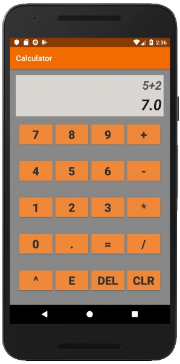

# Basic Calculator Android App  
 

To use source code : 
1. Clone Repository <br>
```git clone https://github.com/ft-abhishekgupta/android-basic-calculator```
1. Open Repository in Android Studio
1. Sync Project and Install Required Dependencies
1. Build and Run Project.

## Screenshot
